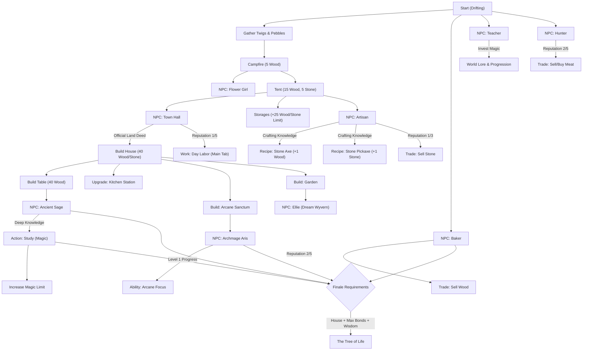

# Progression Tree: Your Earned Wings

This document provides an overview of the dependencies and unlock chains in Draconia, aligned with the **Golden Master (Core 3.7)** architecture.

## Progression Stages

### Stage 1: The Beginning (Survival)

- **Focus**: Resource gathering and basic survival.
- **Core Stats**: 50 Max Energy / 50 Max Magic.
- **Milestone**: Building the first campfire and meeting the Baker and Teacher.

### Stage 2: Establishment (Settlement)

- **Focus**: Infrastructure and community.
- **Storage**: Starting capacity is **25** for wood and stone. Building **Stone and Wood Storages** expands this to **50**.
- **Milestone**: Obtaining the Land Deed and building the House (40 Wood / 40 Stone). Unlocking the House further expands global limits to **75/125**.

### Stage 3: Refinement (The Dream)

- **Focus**: Advanced systems and optimization.
- **Decentralized Trade**: NPCs offer trades based on trust.
  - **Baker**: Buys Wood (Reputation 2+).
  - **Hunter**: Buys/Sells Meat (Reputation 2+).
- **Arcane Focus**: Automating tasks using Magic Drain (1.0/s) instead of Energy.
- **Milestones**:
  - **Arcane Sanctum**: Unlocks Archmage Aris and Astral Shards.
  - **Kitchen Station**: Unlocks Gourmet Cooking for long-lasting buffs.
  - **Garden Expansion**: Meeting Ellie and upgrading the garden for parallel planting.

### Stage 4: The Transformation (The Finale)

- **Focus**: Transcending physical needs via the **Milestone System**.
- **Requirements**:
  - **Structure**: Permanent House completed.
  - **Trust**: Full bond (Level 5) with key NPCs (Baker, Teacher, Sage).
  - **Wisdom**: Expanding the Magic limit via study (3+ successful sessions).
- **Final Action**: Accessing the Tree of Life once all Milestone requirements are met.

## Core Systems Alignment

- **Milestone System**: Logic is fully handled by `milestones.logic.ts` in the Story feature. No hardcoded story triggers in the codebase.
- **Passive Production**: The Garden and other periodic gains use a universal engine ticker.
- **Arcane Focus**: Magical automation that eliminates energy costs in exchange for magic drain.
- **Interaction**: All social interactions are bond-driven. Salary-based companion logic has been removed to favor a magic-based system.
