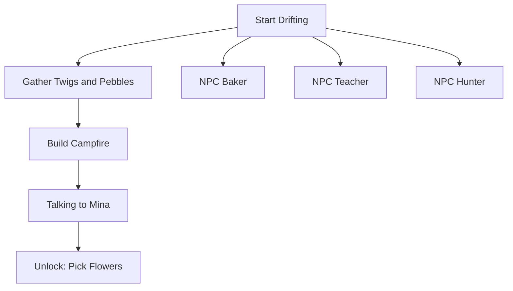
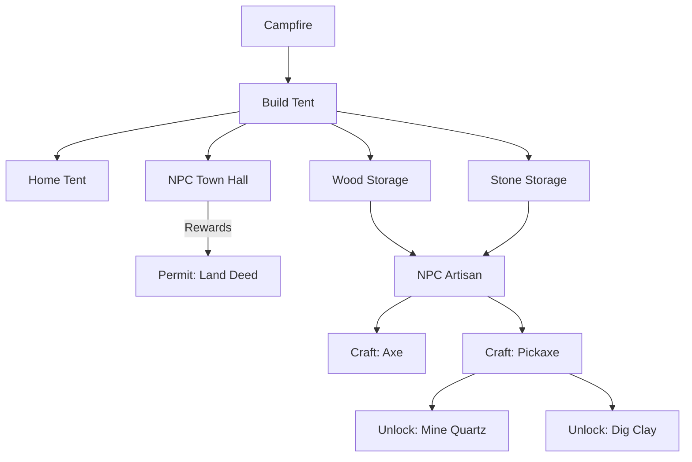
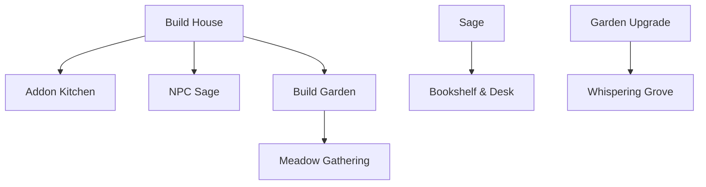

# Progression Tree: Your Earned Wings

This document provides a detailed overview of the dependencies and unlock chains in Draconia, structured by chapters and systems, aligned with **Project Core 6.0 (Audit Hardened)**.

---

## Chapter 1: The Beginning (Village Life)

Focuses on basic survival and establishing a presence in the village.

---

## Chapter 2: Establishment and Crafting

Focuses on shelter, resource storage, and the introduction of tools.

---

## Chapter 3: Refinement and Knowledge

Focuses on permanent housing, furniture, and advanced locations.

---

## Minimum Standard Checklist

Every new progression node added to the registries must follow this flow:

1.  Requirement: Flags or Resource costs (Verified by `check-logic`).
2.  Execution: Action definition in core.ts or construction.ts.
3.  Unlock: onSuccess effects (setFlag, unlockRecipe, unlockNPC).
4.  Feedback: Unique SFX, Particle, and Recursive Log entry.

---

Last updated: April 2026 · v6.0 (Audit Hardened)
