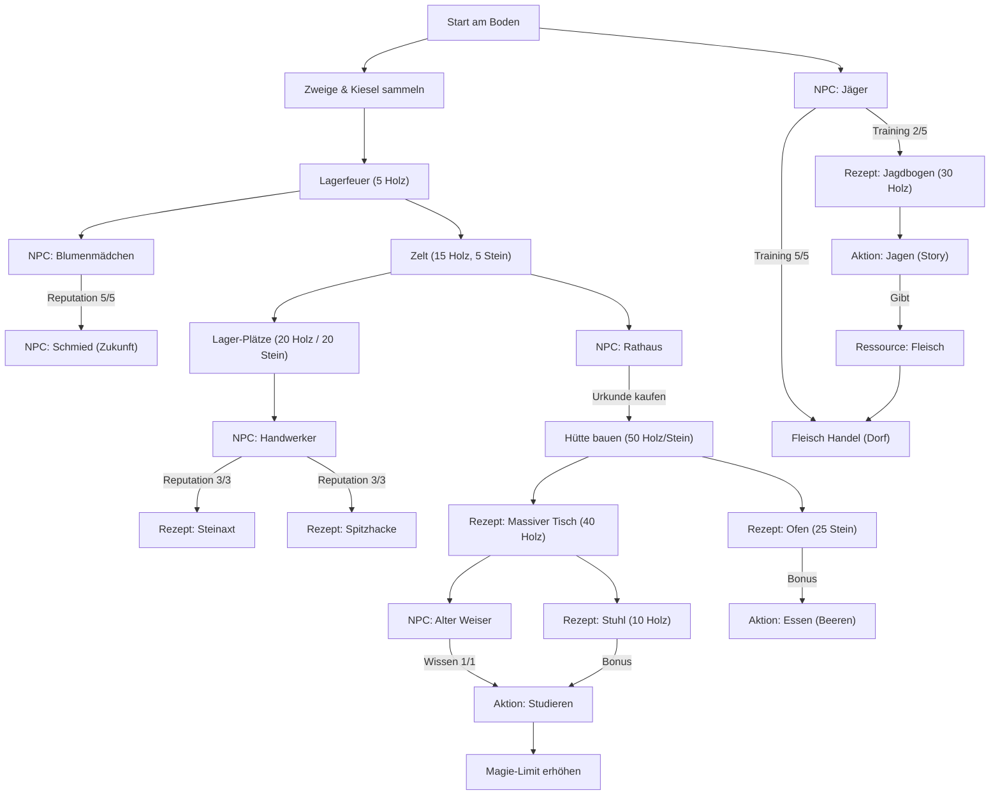

# Progression Tree: Your Earned Wings

Hier findest du eine Übersicht über die Abhängigkeiten und Freischalt-Ketten im Spiel.

## Erläuterung
- **Bauwerke & Möbel**: Schalten oft neue Interaktionen oder passive Boni frei.
- **NPCs**: Benötigen Fortschritt (Interaktionen), um Belohnungen wie Rezepte oder neue Aktionen freizugeben.
- **Werkzeuge**: Erhöhen den Ertrag pro Klick massiv (z.B. Axt: 1 Holz -> 2 Holz).
