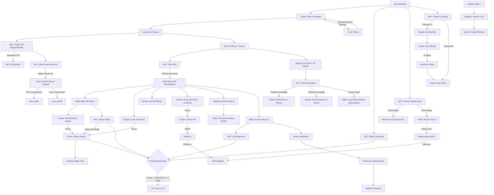

# Progression Tree: Your Earned Wings

This document provides an overview of the dependencies and unlock chains in Draconia.

## Progression Stages

### Stage 1: Survival (The Camp)
*   **Focus**: Resource gathering and basic survival.
*   **Core Stats**: 50 Max Energy / 50 Max Magic (Symmetric Balance).
*   **Milestone**: Building the first tent and meeting the Baker.

### Stage 2: Settlement (The Home)
*   **Focus**: Infrastructure and community.
*   **Storage**: Maximum capacity of 50 for primary resources.
*   **Milestone**: Obtaining the Land Deed and building the House (40 Wood / 40 Stone).

### Stage 3: Refinement (The Mastery)
*   **Focus**: Concentration of energy and optimization.
*   **Arcane Focus**: Unlocking the ability to automate tasks using Magic Drain (3/s) instead of Energy.
*   **Milestones**:
    *   **Arcane Sanctum**: Unlocks Archmage Aris and the generation of Astral Shards.
    *   **Kitchen Station**: Unlocks Gourmet Cooking for long-lasting buffs (+10 Satiation per meal).
    *   **Garden Expansion**: Doubles harvest capacity via parallel slots.
    *   **Dream Wyvern**: Meeting Ellie and unlocking the Dream Bloom action for speed bonuses.

### Stage 4: Eternal Roots (The Finale)
*   **Focus**: Transcending the physical needs to touch the world's heart (Requires 60 Magic via Study).
*   **Requirements**:
    *   **Structure**: Completed permanent House.
    *   **Trust**: Full bond (Level 5) with the Baker, the Teacher, and the Ancient Sage (Mastery level reached).
    *   **Wisdom**: At least 3 successful Study sessions performed (Expanding the Magic limit).
*   **Final Action**: Accessing the Tree of Life via the "Action Hub" once requirements are met.

## Explanation
- **Draconia Reality**: In a world where magic is the fuel for life, resources are more than just items—they are survival.
- **Teacher & Lore**: Investing **Magic** into the Teacher's lessons is the primary way to understand the world and progress through narrative milestones.
- **Housing & NPCs**: Structures like the Campfire or House aren't just for rest; they attract NPCs like the Flower Girl or the Artisan, who provide recipes for the primary toolset.
- **Arcane Focus**: Unlike previous iterations, automation is no longer handled by villagers but by the player's own focus. This drains magic constantly but replaces the energy cost of the automated action.
- **Satiation**: Keeping your satiation high (+10 per click) is crucial. It directly impacts your gathering efficiency and prevents energy drain during rest.
- **Loop Mode**: Unlocked as an innate insight, this allows for the manual repetition of tasks, while Arcane Focus handles the "Magic" version.
