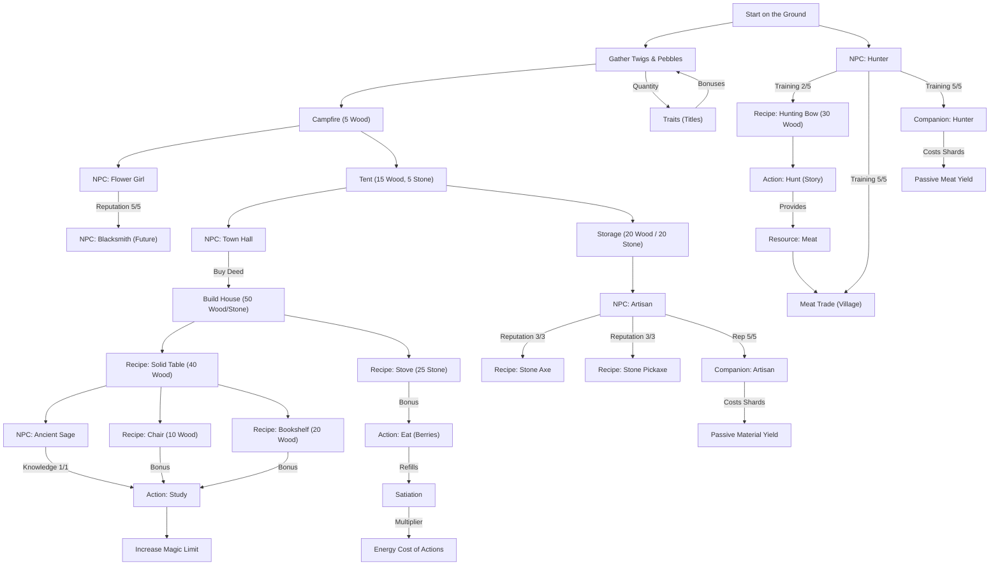

# Progression Tree: Your Earned Wings

This document provides an overview of the dependencies and unlock chains in the game.

## Explanation
- **Structures & Furniture**: Unlock new interactions, storage limits, or passive bonuses to actions.
- **NPCs**: Require progress (interactions) to release rewards like recipes, new actions, or become **Companions**.
- **Companions**: Once an NPC is fully befriended, they can work for you (managed in the Village tab), providing passive resource yields in exchange for a Shard-based salary.
- **Tools**: Massively increase yield per click (e.g., Axe: 1 Wood -> 2 Wood).
- **Traits (Titles)**: Unlocked by reaching total gathering milestones (e.g., 100 Wood for "Woodcutter"). They provide permanent passive bonuses to yield or costs.
- **Satiation Loop**: Eating food maintains Satiation. High Satiation (>80%) reduces Energy costs by 20%, while low Satiation (<20%) increases costs by 50%.
- **Architecture**: The game uses a centralized Resource Manager and Transaction System to handle all resource flows and unlocks.
