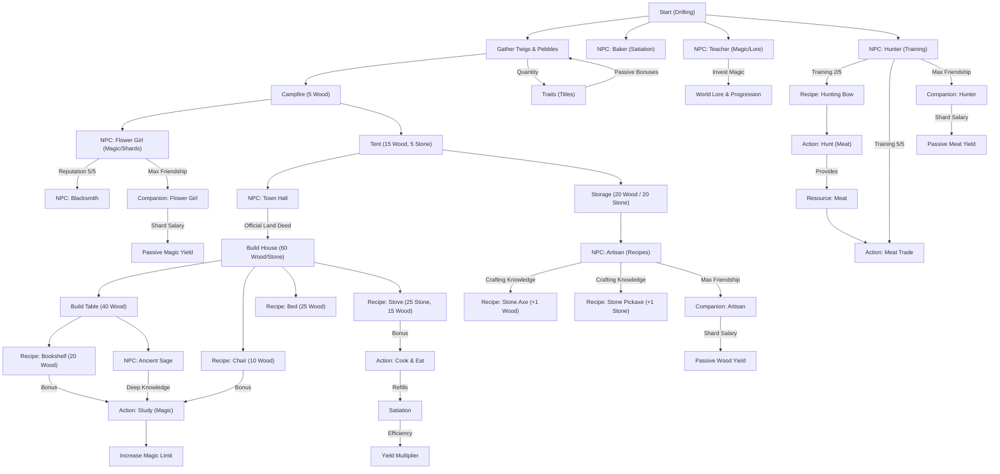

# Progression Tree: Your Earned Wings

This document provides an overview of the dependencies and unlock chains in Draconia.

## Explanation
- **Draconia Reality**: In a world where magic is the fuel for life and the Lava Sea is ever-present, resources are more than just items—they are survival.
- **Teacher & Lore**: Investing **Magic** into the Teacher's lessons is the primary way to understand the world and progress through narrative milestones.
- **Housing & NPCs**: Structures like the Campfire or House aren't just for rest; they attract NPCs like the Flower Girl or the Artisan, who provide the recipes needed for higher-tier tools.
- **Companions**: Fully befriending an NPC allows you to employ them in the Village. This transitions the game from active gathering to passive management.
- **Satiation**: Keeping your satiation high is crucial. It directly impacts your gathering efficiency and energy consumption.
- **Tools**: The Axe and Pickaxe significantly boost resource yields, making them top priorities for early-game progression.
