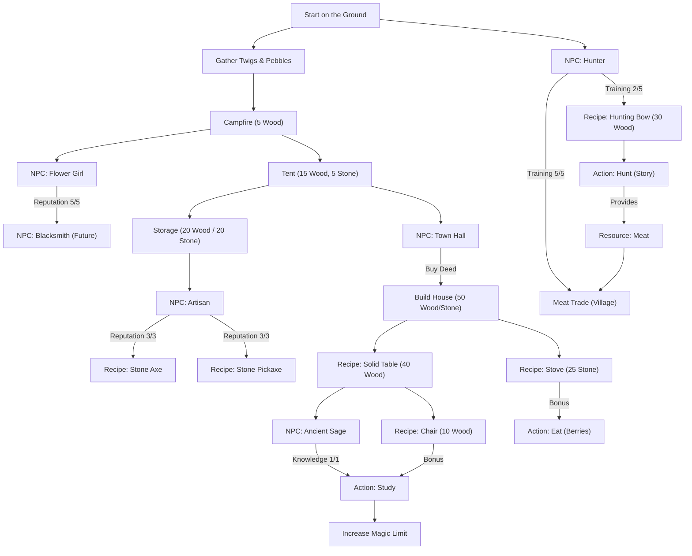

# Progression Tree: Your Earned Wings

This document provides an overview of the dependencies and unlock chains in the game.

## Explanation
- **Structures & Furniture**: Often unlock new interactions or passive bonuses.
- **NPCs**: Require progress (interactions) to release rewards like recipes or new actions.
- **Tools**: Massively increase yield per click (e.g., Axe: 1 Wood -> 2 Wood).
- **Architecture**: The game uses a centralized Resource Manager to handle these transitions efficiently.
