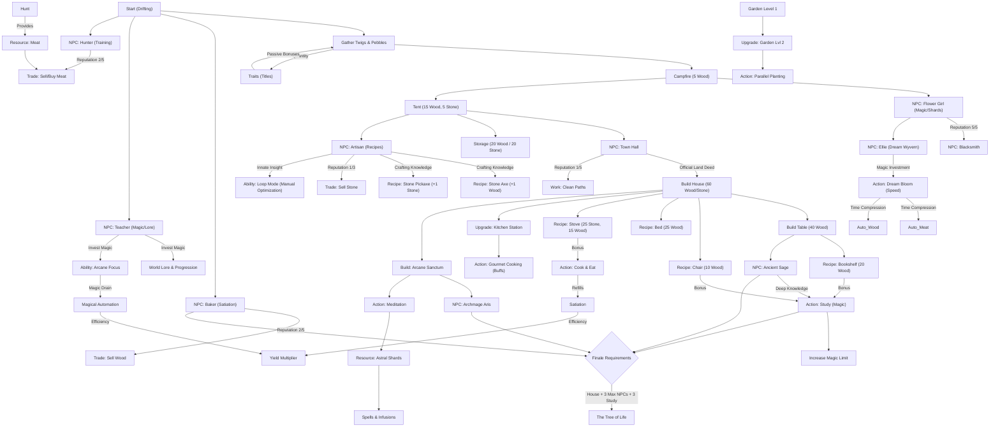

# Progression Tree: Your Earned Wings

This document provides an overview of the dependencies and unlock chains in Draconia.

## Progression Stages

### Stage 1: Survival (The Camp)

* **Focus**: Resource gathering and basic survival.
* **Core Stats**: 50 Max Energy / 50 Max Magic (Symmetric Balance).
* **Milestone**: Building the first tent and meeting the Baker.

### Stage 2: Settlement (The Home)

* **Focus**: Infrastructure and community.
* **Storage**: Maximum capacity of 50 for primary resources.
* **Milestone**: Obtaining the Land Deed and building the House (40 Wood / 40 Stone).

### Stage 3: Refinement (The Mastery)

* **Focus**: Concentration of energy and optimization.
* **Decentralized Trade**: Trading is no longer a centralized market but a trust-based interaction with NPCs.
  * **Baker**: Buys Wood (Reputation 2+).
  * **Hunter**: Buys/Sells Meat (Reputation 2+).
  * **Artisan**: Buys Stone (Reputation 1+).
  * **Town Hall**: Allows working for Shards (Reputation 1+).
* **Arcane Focus**: Unlocking the ability to automate tasks using Magic Drain (3/s) instead of Energy.
* **Milestones**:
  * **Arcane Sanctum**: Unlocks Archmage Aris and the generation of Astral Shards.
  * **Kitchen Station**: Unlocks Gourmet Cooking for long-lasting buffs (+10 Satiation per meal).
  * **Garden Expansion**: Doubles harvest capacity via parallel slots.
  * **Dream Wyvern**: Meeting Ellie and unlocking the Dream Bloom action for speed bonuses.

### Stage 4: Eternal Roots (The Finale)

* **Focus**: Transcending physical needs via the **Milestone System**.
* **Requirements**: Managed by `milestones.js`.
  * **Structure**: Completed permanent House.
  * **Trust**: Full bond (Level 5) with key NPCs.
  * **Wisdom**: Expanding the Magic limit via study.
* **Final Action**: Accessing the Tree of Life once the engine validates all Milestone requirements.

## Explanation

* **Draconia Reality**: In a world where magic is the fuel for life, resources are more than just items—they are survival.
* **Milestone System**: Replaces hardcoded progression checks with a generic requirement engine (`op: '>=', val: X`).
* **Passive Production**: Buildings like the Garden now utilize a universal engine ticker for resource generation.
* **Arcane Focus**: Automation is handled by the player's own focus, draining magic but eliminating energy costs.
* **Satiation**: Keeps gathering efficiency high and facilitates recovery.
* **Loop Mode**: Allows manual repetition of tasks, synergizing with Arcane Focus.
