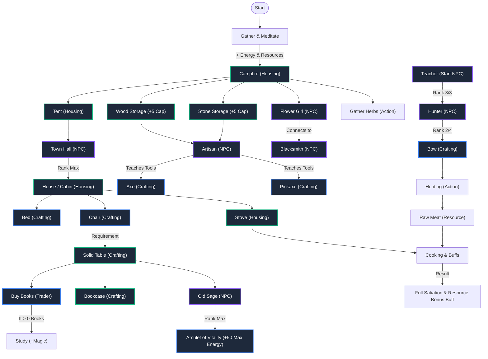

# Game Progression & Unlock Tree

Here is the complete overview of when actions, new mechanics, buildings, craftable items, and story NPCs are unlocked. When new features are added, this diagram will be updated!

> [!TIP]
> **Tip:** As new mechanics are added, this web will continue to grow. You can open this artifact at any time to analyze all dependencies at a glance!
